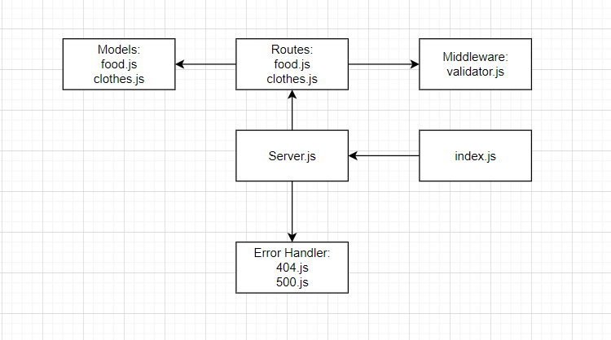

# Class 03- Lab03
# Basic API Server
## Deployment Test
### Author: Boshra Jaber
* [tests report](https://github.com/BoshraJaber/basic-api-server/actions)
* [Heroku application for main branch- Food ](https://boshra-basic-api-server.herokuapp.com/api/v1/food)
* [Heroku application for main branch- Clothes ](https://boshra-basic-api-server.herokuapp.com/api/v1/clothes)
* [Pull Request to main](https://github.com/BoshraJaber/basic-api-server/pull/2)

## Setup
- `.env` requirements:
 * PORT - 3000
- Install Required Packages:
  * `npm i express dotenv cors morgan uuid`
  * `npm i -d jest supertest eslint`
  * `npm i -g nodemon`
- Running the app
 * `npm start`
 1. Endpoint: `/api/v1/clothes/`
   * Returns Object:
  ```
  {
   "type" : "T-shirt",
   "price" : "5JD"
  }
  ```
 2. Endpoint: `/api/v1/clothes/id`
  1. Method : Get 
   * Returns Object:
  ```
  {
   "type" : "T-shirt",
   "price" : "5JD"
  }
  ``` 
  2.  Method : POST 
   * Returns Object that have been added
  3.  Method : PUT 
   * Returns Object that have been updated
  4. Method : Delete 
   * Returns Object with the record of the ID deleted.

 3. Endpoint: `/error`
   * Returns Object:
  ```
  {
   "error": "Something went wrong!",
   "route": "/error",
   "message": "Error with the server"
   }
  ```
 4. Endpoint: `/random`
   * Returns Object:
  ```
  {
   "error": 404,
   "route": "/",
   "message": "Not Found"
   }
  ```
- In package.json file add:
  ```
  "scripts": {
    "start": "node index.js",
    "dev": "nodemon",
    "test": "jest --coverage --verbose ",
    "lint": "eslint '**/*.js'"
  }
  ```

## Tests
Unit Tests: `npm run test`
Lint Tests: `npm run lint`

## UML:
Here is a UML of my code: 
